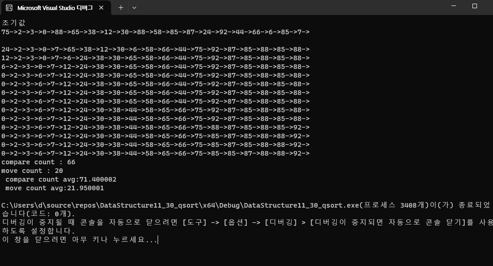

# DataStructure11_30_qsort
결과분석 
선택정렬은 비교 평균 약190회
           이동 평균 19회
           합 219회
합병정렬은 비교 평균 약63회
           이동 평균 83회
           합 146회
           
이지만
퀵정렬은 비교 평균 70회
         이동 평균 21회로
         합 91회로 연산의 횟수가 확연히 차이가 난다
이것이 quick sort가 현대 가장 많이 사용되는 정렬인 이유를 알 수 있다 .
거기에 더하여 코드 자체도 다른 정렬이 비해 비교적 간단 간결하여 구현의 용이성도 있다 

qsort

